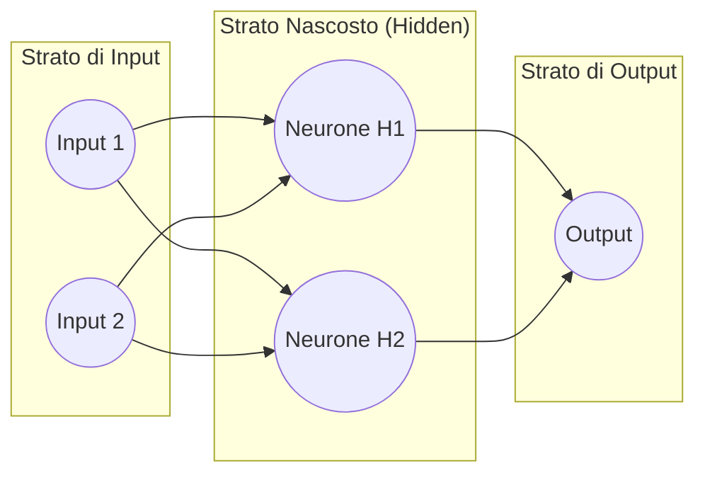

# Ora 1: Dal Neurone Biologico alle Reti Neurali

---

## | [« Indice Giorno 1](README.md) | **Ora 1: Dal Neurone Biologico alle Reti Neurali** | [Ora 2: Spettro IA e Context Engineering](02-vibe-coding-agentic-engineering.md) » |

In questa prima ora esploreremo le fondamenta teoriche dell'Intelligenza Artificiale Generativa, analizzando i parallelismi con il funzionamento del cervello umano, i limiti intrinseci dei modelli e come l'approccio allo sviluppo software stia cambiando radicalmente.

---

## 📈 1. La Scala Evolutiva dell'IA

Per comprendere i moderni modelli di linguaggio (LLM), dobbiamo posizionarli all'interno dell'evoluzione storica dell'informatica:

```mermaid
graph TD
    A["Informatica Tradizionale<br>(Regole scritte a mano da umani)"] --> B["Machine Learning<br>(Apprendimento statistico dai dati)"]
    B --> C["Deep Learning<br>(Reti neurali artificiali multi-strato)"]
    C --> D["Generative AI & LLM<br>(Predittori e generatori di pattern complessi)"]
    style A fill:#333,stroke:#ccc,stroke-width:1px
    style B fill:#333,stroke:#ccc,stroke-width:1px
    style C fill:#333,stroke:#ccc,stroke-width:1px
    style D fill:#333,stroke:#ccc,stroke-width:1px
```

### 💻 Informatica Tradizionale vs Machine Learning

- **Informatica Tradizionale**: Segue la formula `Input + Regole = Output`. L'essere umano analizza il problema e scrive rigide righe di codice (regole esplicite con `if/else`, cicli, funzioni) per elaborare dei dati di input e produrre un risultato.
- **Machine Learning (ML)**: Ribalta la prospettiva con la formula `Input + Output = Regole`. Invece di programmare le regole, forniamo alla macchina migliaia di esempi (coppie di input e output attesi, detti _training data_) e un algoritmo statistico. La macchina analizza questi dati per calcolare da sola le regole matematiche latenti che collegano gli input agli output.

---

### 🧠 Deep Learning e Reti Neurali Artificiali

Il **Deep Learning** è una branca del Machine Learning basata sulle **Reti Neurali Artificiali** (Artificial Neural Networks), modelli matematici ispirati in modo semplificato alla struttura dei neuroni biologici nel cervello umano.

#### 1. Cos'è una Rete Neurale?

Una rete neurale è una struttura a strati (layer) costituita da migliaia o milioni di unità di calcolo collegate tra loro, chiamate **neuroni artificiali (o nodi)**.

#### 2. Come Funziona una Rete Neurale?

1. **Propagazione in avanti (Forward Propagation)**: I dati entrano nello _Strato di Input_ (es. i valori dei pixel di un'immagine di un cane). Ciascun neurone dello strato successivo riceve i dati dai neuroni precedenti, esegue una somma pesata di questi segnali, applica una funzione matematica (funzione di attivazione) e invia il risultato allo strato successivo. Lo strato finale (_Strato di Output_) emette la previsione (es. "Cane al 95%").
2. **Retropropagazione dell'errore (Backpropagation)**: Durante la fase di addestramento, la rete confronta la sua risposta con quella corretta. Se sbaglia (es. scambia un gatto per un cane), l'algoritmo calcola l'errore e lo propaga all'indietro nella rete, modificando i collegamenti interni per ridurre l'errore nel tentativo successivo.

#### 3. Cosa sono i Pesi (Weights)?

Ogni collegamento tra due neuroni è caratterizzato da un valore numerico chiamato **Peso (Weight)**.

- **Il peso definisce l'importanza del collegamento**: Funziona come un "potenziometro" o moltiplicatore. Se un peso è vicino a zero, il segnale passante viene ignorato. Se il peso è molto alto, quel collegamento ha un'influenza determinante sul comportamento del neurone successivo.
- Addestrare una rete neurale significa **trovare la configurazione ideale di tutti i suoi pesi** attraverso milioni di tentativi, affinché gli input producano sempre l'output corretto. I modelli GPT-4 o Gemini possiedono centinaia di miliardi di pesi individuali.

---

### 🔤 Large Language Models (LLM) e i Token

Un **Large Language Model (LLM)** è una rete neurale gigantesca (basata su un'architettura chiamata _Transformer_) addestrata specificamente per comprendere e generare il linguaggio umano. Tuttavia, le reti neurali comprendono solo numeri, non lettere. Per elaborare il testo, utilizzano la **Tokenizzazione**.

#### 1. Cosa sono i Token?

I computer non leggono le parole intere. Prima di inviare il testo al modello, questo viene scomposto in frammenti chiamati **Token**.

- Un token può corrispondere a una parola intera ("casa"), a una parte di essa ("anti-", "-gravity") o a un singolo carattere ("a").
- In media, in lingua inglese 100 parole equivalgono a circa 75 token. In italiano, a causa delle coniugazioni e della struttura morfologica, la scomposizione può generare più token per parola.
- Ciascun token viene associato a un numero identificativo univoco (ID) e poi convertito in un **vettore di embedding** (una stringa di centinaia di numeri che rappresenta matematicamente il significato semantico di quel frammento nello spazio concettuale del modello).

#### 2. Come Generano il Testo gli LLM?

- L'LLM riceve una sequenza di token in input (il tuo prompt).
- Attraverso i suoi miliardi di pesi e calcoli matriciali, analizza le relazioni tra i token passati e calcola una tabella di probabilità per tutti i token che conosce (il suo vocabolario).
- Seleziona il token successivo più probabile (o uno dei più probabili in base a parametri come la _Temperatura_) ed emette la parola.
- Aggiunge il token appena generato all'input e ripete il ciclo da capo, parola dopo parola, fino a terminare il discorso.

#### 🎥 Video di Approfondimento: Come funzionano gli LLM

Durante la spiegazione proietteremo questo video didattico che illustra il funzionamento visivo dei Large Language Models:

- **Video**: [Dentro l'IA - Come funzionano i grandi modelli linguistici (LLM)? - Federico Ruggeri](https://www.youtube.com/watch?v=BkRKu3mn-o4) (Zanichelli)
- **Temi chiave**: Il meccanismo probabilistico della predizione del token successivo, l'addestramento tramite _slot filling_ (completamento di parole mancanti), la necessità di miliardi di parametri e la differenza tra calcolo probabilistico e ragionamento conscio.

---

## 🦜 2. Oltre i "Pappagalli Stocastici"

Negli ultimi anni si è diffusa l'idea che i modelli di linguaggio siano semplici "pappagalli stocastici" (stochastic parrots), ovvero riproduttori casuali di parole sentite in precedenza, privi di qualsiasi struttura logica.

> [!IMPORTANT]
> **Oggi questa visione è ampiamente superata.** Sebbene a livello di calcolo di base l'LLM selezioni la parola successiva più probabile, per farlo in modo coerente su testi lunghi e complessi deve internamente costruire e percorrere una **direzione logica e semantica coerente**.

Il modello non "tira a indovinare" la parola successiva basandosi solo sulle tre parole precedenti; al contrario, sviluppa una **rappresentazione dello spazio concettuale** dell'intero testo. Quando risponde:

- Segue un filo conduttore.
- Mantiene la coerenza del discorso.
- Rispetta vincoli logici impostati all'inizio.

### Il Parallelismo Umano

Pensa a come parliamo noi esseri umani. Quando rispondi a una domanda, raramente pianifichi in anticipo ogni singola parola che dirai. Spesso inizi a parlare avendo in mente solo un'**idea concettuale semantica, quasi inconscia**, del discorso che vuoi costruire. Il tuo cervello traduce dinamicamente quell'intento concettuale in singole parole via via che parli.

Allo stesso modo, i modelli di linguaggio, attraverso i loro strati di attenzione (Transformer Attention Blocks), costruiscono uno stato logico interno che guida la generazione del testo lungo una traiettoria coerente, imitando concettualmente questa direzionalità del pensiero umano.

---

## 🔬 3. Neuroscienze: Plasticità Sinaptica e Memoria

Per comprendere meglio come l'IA apprende e memorizza, facciamo un salto nelle neuroscienze biologiche.

### 🎥 Video di Ispirazione: Come apprende il cervello umano

Durante la lezione guarderemo insieme questo video della Prof.ssa Michela Matteoli (coordinatrice scientifica del Neuro Center di Humanitas e direttrice dell'Istituto di Neuroscienze del CNR):

- **Video**: [Come funziona il cervello umano nell'apprendimento](https://www.youtube.com/watch?v=tLgo3FK1FMc)
- **Durata**: 18 minuti (visione dall'inizio)

> **Punti chiave del video su cui riflettere:**
>
> 1. **Connettività Cerebrale**: Le funzioni del nostro cervello (memoria, creatività, ragionamento) non dipendono da singole aree isolate, ma dalla complessità e dall'efficienza delle connessioni (sinapsi) che collegano le diverse aree.
> 2. **Plasticità Sinaptica**: Ogni volta che studiamo, proviamo un'emozione o impariamo un'attività, il cervello cambia fisicamente la sua struttura, creando nuove sinapsi e rafforzando quelle esistenti.
> 3. **Consolidamento della Memoria**: Il ruolo centrale dell'ippocampo (che gestisce la transizione da memoria a breve a lungo termine) e la sua forte interazione con l'amigdala (il centro delle emozioni). Memorizziamo molto meglio ciò che ci emoziona o ci coinvolge attivamente.

---

### 🧬 Il Parallelismo con il Software e i Sistemi Agentici

Il parallelismo tra il cervello umano e l'IA si sviluppa su due livelli:

#### A. L'Addestramento e la Potatura (Pruning)

- **Nel cervello umano**: Durante l'infanzia creiamo una quantità enorme di connessioni sinaptiche. Successivamente, attraverso un processo chiamato _synaptic pruning_ (potatura sinaptica), il cervello elimina le connessioni inutilizzate o ridondanti per ottimizzare l'efficienza energetica e cognitiva.
- **Nell'IA**: Durante l'addestramento, la rete neurale regola i suoi "pesi" (weights) matematici. Successivamente, per rendere i modelli utilizzabili su computer o telefoni comuni, si applicano tecniche di **pruning** (azzeramento dei pesi meno importanti) e **quantizzazione** (riduzione della precisione numerica dei pesi), simulando lo sfoltimento biologico per risparmiare memoria e tempo di calcolo.

#### B. La Memoria Agentica

- **Nel cervello umano**: La memoria non è un hard disk statico; è una riconfigurazione dinamica e stabile di sinapsi che si attiva quando stimolata (es. ippocampo che richiama le informazioni).
- **Negli Agenti IA**: I primi LLM erano privi di memoria di sessione (ad ogni domanda perdevano il contesto precedente). Gli agenti moderni implementano un'infrastruttura di **Memoria Agentica** divisa in:
  - **Short-term memory**: I registri delle azioni appena compiute e i log di sessione (il contesto immediato di lavoro).
  - **Long-term memory**: File di configurazione persistenti (es. `AGENTS.md` o database vettoriali di conoscenza) che consentono all'agente di ricordare regole, preferenze dell'utente e specifiche del progetto attraverso interazioni successive, evitando di ricominciare ogni volta da zero.

---

## 🚫 4. Umani vs LLM: I Limiti dell'IA

Nonostante l'eccezionale abilità degli LLM nel manipolare concetti e generare testo logico, esiste un divario insuperabile rispetto alla mente umana:

| Dimensione                     | Essere Umano                                                                      | Large Language Model (LLM)                                                             |
| :----------------------------- | :-------------------------------------------------------------------------------- | :------------------------------------------------------------------------------------- |
| **Coscienza & Consapevolezza** | Possiede una mente soggettiva, sperimenta il mondo (qualia) ed è cosciente di sé. | Modello matematico probabilistico. Non ha coscienza, sentimenti o percezione di sé.    |
| **Intenzionalità e Volontà**   | Agisce guidato da scopi personali, bisogni biologici ed emozioni.                 | Risponde solo quando viene interrogato. Privo di volontà propria o autoaffermazione.   |
| **Esperienza del mondo**       | Relazione fisica e sensoriale con l'ambiente reale (tatto, vista, gravità).       | Conoscenza astratta derivata esclusivamente da dati testuali o multimediali (simboli). |
| **Autoaffermazione**           | Cerca di proteggere la propria esistenza e le proprie idee.                       | Non ha istinto di sopravvivenza o preferenze reali, se non quelle simulate nel prompt. |

> [!WARNING]
> Confondere la fluidità linguistica di un LLM con la coscienza è un errore comune (antropomorfizzazione). Gli LLM sono strumenti di amplificazione cognitiva, non esseri senzienti.

---

## 🎯 5. Dalla Sintassi all'Intento

Il focus di questa prima lezione ci porta a una conclusione fondamentale: **imparare a programmare nell'era dell'IA significa smettere di concentrarsi sulla sintassi e iniziare a concentrarsi sull'intento.**

Se l'IA è in grado di generare la sintassi corretta a partire da una descrizione, la tua responsabilità come sviluppatore diventa:

1. **Definire i requisiti e i limiti logici** in modo impeccabile.
2. **Fornire il contesto corretto** all'IA per evitare errori o allucinazioni.
3. **Verificare la correttezza dell'output** tramite il test e il ragionamento logico.

Nelle prossime ore vedremo come tradurre queste considerazioni in tecniche di Prompt Engineering e sviluppo agentico.

---

[« Indice Giorno 1](README.md) | **Ora 1: Dal Neurone Biologico alle Reti Neurali** | [Ora 2: Spettro IA e Context Engineering](02-vibe-coding-agentic-engineering.md) » |
