# Ora 2: Lo Spettro dell'IA e il Context Engineering

---

## | [« Ora 1: Neurone Biologico e Reti Neurali](01-neurone-biologico-reti-neurali.md) | **Ora 2: Spettro IA e Context Engineering** | [Ora 3: AI-Driven SDLC, Setup e Pratica](03-sdlc-ruoli-setup.md) » |

In questa seconda ora approfondiremo come dialogare con i modelli di linguaggio in modo disciplinato (Prompt Engineering), come gli agenti autonomi gestiscono il loro ciclo di lavoro, lo spettro che separa il "Vibe Coding" dall'ingegneria agentica ed effettueremo una sessione di prototipazione in Google AI Studio.

---

## 🔌 1. Tecniche di Prompt Engineering (Esempi Pratici NON-Web Dev)

Il Prompt Engineering è l'arte e la scienza di strutturare gli input per ottenere risposte ottimali e prevedibili da un LLM. Di seguito analizziamo le 4 tecniche principali con esempi pratici non legati allo sviluppo software.

### A. Zero-shot Prompting

Consiste nel chiedere all'IA di eseguire un compito senza fornirle alcun esempio precedente. Funziona bene per compiti semplici e per modelli molto potenti.

- **❌ Prompt Sbagliato (Troppo generico)**:

  ```text
  Riassumi questo testo storico sulle guerre puniche.
  [Testo Storico di 3 pagine]
  ```

  _Perché è inefficace_: Il modello non sa quale sia la lunghezza desiderata, il tono, il pubblico di riferimento o quali dettagli privilegiare. Genererà un testo di lunghezza casuale e con un focus arbitrario.

- **✅ Prompt Giusto (Specifico e vincolato)**:

  ```text
  Ruolo: Sei uno storico divulgatore per ragazzi delle scuole medie.
  Compito: Riassumi il testo storico fornito in un elenco puntato di massimo 5 punti.
  Vincoli: Focus esclusivamente sulle cause scatenanti del conflitto e sulle figure di Annibale e Scipione. Usa un tono avvincente ma rigoroso.
  Testo:
  [Testo Storico di 3 pagine]
  ```

---

### B. Few-shot Prompting

Consiste nel fornire al modello 2 o più esempi concreti di input e output attesi per addestrarlo al volo sul formato o sullo stile desiderato. È fondamentale quando si richiede una formattazione rigida o una classificazione specifica.

- **❌ Prompt Sbagliato**:

  ```text
  Classifica le recensioni dei libri in Positiva, Neutra o Negativa.
  Recensione: "Il libro parte bene ma si perde a metà, noioso."
  ```

  _Perché è inefficace_: Il modello potrebbe rispondere argomentando: _"Questa recensione è parzialmente negativa perché parla di noia, ma l'inizio era buono, quindi..."_ invece di restituire una singola parola.

- **✅ Prompt Giusto**:

  ```text
  Classifica le recensioni dei libri utilizzando esclusivamente una di queste etichette: POSITIVA, NEUTRA, NEGATIVA. Segui esattamente lo stile degli esempi.

  Input: "Un capolavoro assoluto, consigliato a tutti!"
  Output: POSITIVA

  Input: "La spedizione è stata rapida ma la copertina era leggermente graffiata."
  Output: NEUTRA

  Input: "Personaggi piatti e trama prevedibile. Non sono riuscito a finirlo."
  Output: NEGATIVA

  Input: "Il libro parte bene ma si perde a metà, noioso."
  Output:
  ```

---

### C. Chain of Thought (CoT) Prompting

Consiste nello spingere l'IA a scomporre un ragionamento complesso in passaggi logici intermedi prima di dare la risposta finale. Questo riduce drasticamente gli errori logico-matematici.

- **❌ Prompt Sbagliato**:

  ```text
  Un hotel ha 5 piani. Ogni piano ha 10 stanze. Metà delle stanze ha 2 letti singoli, l'altra metà ha 1 letto matrimoniale. Quanti letti ci sono in totale nell'hotel? Dimmi solo il numero.
  ```

  _Perché è inefficace_: Chiedere una risposta diretta costringe il modello a calcolare il token numerico successivo in un solo passaggio di attenzione, portando spesso a calcoli errati.

- **✅ Prompt Giusto**:

  ```text
  Risolvi il seguente problema logico-matematico. Pensa e ragiona passo dopo passo, spiegando ogni passaggio logico prima di fornire il risultato finale.
  Problema: Un hotel ha 5 piani. Ogni piano ha 10 stanze. Metà delle stanze ha 2 letti singoli, l'altra metà ha 1 letto matrimoniale. Quanti letti ci sono in totale nell'hotel?
  ```

---

### D. Context Engineering (Istruzioni di Sistema)

Consiste nel fornire all'IA una base di dati o un documento di contesto a cui fare rigorosamente riferimento per rispondere, vietandole di usare informazioni esterne per evitare allucinazioni.

- **❌ Prompt Sbagliato**:

  ```text
  Posso tenere un cane di grossa taglia nel condominio "Fiori"?
  ```

  _Perché è inefficace_: L'IA non conosce il condominio specifico e risponderà basandosi su leggi generali italiane o, peggio, inventerà una risposta plausibile (allucinazione).

- **✅ Prompt Giusto**:

  ```text
  Usa esclusivamente il regolamento condominiale allegato sotto per rispondere alla domanda.
  Se la risposta non è presente nel testo, rispondi rigorosamente con "Non ho informazioni sufficienti nel regolamento per rispondere". Non inventare nulla.

  Regolamento Condominiale:
  [Testo del Regolamento con regole sugli animali]

  Domanda: Posso tenere un cane di grossa taglia nel condominio?
  ```

---

## 🤖 2. Cos'è un Agente IA?

Un **Agente IA** non è una semplice chat che attende passivamente un prompt per rispondere. È un sistema software autonomo che opera all'interno di un loop continuo:

```mermaid
graph TD
    A["Percepisci Goal<br>(Analizza l'obiettivo dell'utente)"] --> B["Pianifica Step<br>(Scompone il lavoro in sotto-compiti)"]
    B --> C["Agisci (Uso Strumenti)<br>(Scrive file, esegue comandi, cerca sul web)"]
    C --> D["Osserva Risultati<br>(Verifica output dei comandi o test)"]
    D --> E{"Obiettivo Raggiunto?"}
    E -- No --> B
    E -- Sì --> F["Consegna Output"]
    style A fill:#333,stroke:#ccc,stroke-width:1px
    style B fill:#333,stroke:#ccc,stroke-width:1px
    style C fill:#333,stroke:#ccc,stroke-width:1px
    style D fill:#333,stroke:#ccc,stroke-width:1px
    style E fill:#333,stroke:#ccc,stroke-width:1px
    style F fill:#333,stroke:#ccc,stroke-width:1px
```



### I 5 Componenti Chiave di un Agente

Ogni agente moderno è costituito da 5 parti fondamentali:

1. **Il Modello (LLM)**: Il motore di ragionamento e decisione. Legge il contesto e decide quale azione intraprendere.
2. **Gli Strumenti (Tools)**: Ciò che connette il modello al mondo esterno (es. lettori di file, compilatori, browser web, server MCP).
3. **La Memoria (Memory)**: Mantiene lo stato (i log dei tentativi precedenti, le linee guida di progetto, le regole persistenti).
4. **L'Orchestra (Orchestration)**: Il codice logico che gestisce il ciclo continuo dell'agente (il motore del loop).
5. **Il Runtime (Deployment)**: L'ambiente sicuro (sandbox) all'interno del quale l'agente esegue fisicamente il codice.

---

## ⚖️ 3. Lo Spettro dello Sviluppo con IA

Lavorare con l'IA nella programmazione non è una scelta binaria (usarla o non usarla). Si tratta di uno **spettro operativo** definito dal livello di struttura e di verifica applicati:

| Dimensione                      | Vibe Coding                                                                 | Sviluppo Assistito Strutturato                                                     | Agentic Engineering                                                                     |
| :------------------------------ | :-------------------------------------------------------------------------- | :--------------------------------------------------------------------------------- | :-------------------------------------------------------------------------------------- |
| **Specificazione dell'Intento** | Prompt rapidi e informali in linguaggio naturale.                           | Prompt dettagliati con regole, esempi e contesti circoscritti.                     | Specifiche formali, schemi di architettura e file di regole stabili (es. `AGENTS.md`).  |
| **Verifica**                    | _"Sembra funzionare"_ (test a vista dell'interfaccia).                      | Test manuali mirati ed esecuzione controllata.                                     | Test suite automatizzate, pipeline CI/CD e validazioni programmate (Evals).             |
| **Comprensione del Codice**     | Minima: lo sviluppatore spesso copia e incolla senza leggere il codice.     | Selettiva: analisi approfondita dei moduli critici modificati dall'IA.             | Architetturale: l'uomo presidia la logica di sistema, l'agente gestisce i dettagli.     |
| **Gestione Errori**             | Copia e incolla dei messaggi di errore restituiti dall'IDE all'IA.          | Lo sviluppatore analizza il bug, individua la causa e guida l'IA nella correzione. | L'agente esegue i test, legge i log di errore e si corregge in autonomia nella sandbox. |
| **Scopo Appropriato**           | Prototipi rapidi, script personali, hackathon, esplorazione.                | Nuove funzionalità all'interno di codebase già esistenti e stabili.                | Sistemi di produzione complessi, refactoring di massa, migrazioni stabili.              |
| **Profilo di Rischio**          | **Alto**: codice instabile, potenziale debito tecnico e falle di sicurezza. | **Moderato**: presidiato da checkpoint decisionali umani.                          | **Basso**: ogni modifica è validata da test deterministici e di qualità.                |

---

## 🧪 4. Il Ruolo Fondamentale della Verifica

La differenza principale tra un programmatore amatoriale e un ingegnere del software nell'era dell'IA risiede nella **verifica**.

- **I Test deterministici**: Verificano che a parità di input, una determinata funzione produca lo stesso output (es. `somma(2, 3) == 5`).
- **Le Valutazioni (Evals)**: Poiché gli LLM sono non-deterministici, le Evals verificano la qualità dell'output complessivo (es. _"L'agente ha seguito le linee guida di sicurezza?"_, _"Il codice generato contiene dipendenze allucinate?"_).

> [!CAUTION]
> Scrivere codice con l'IA senza avere una suite di test o un criterio di verifica rigoroso è puro **Vibe Coding ad alto rischio**. Lo sviluppatore deve scrivere i test _prima_ che l'agente scriva il codice applicativo.

---

## 📦 5. I Limiti del Contesto negli LLM ("Lost in the Middle")

Sebbene i modelli di linguaggio moderni vantino finestre di contesto enormi (fino a milioni di token), la loro capacità reale di elaborare le informazioni decade all'aumentare dei dati inseriti.

- **Position Bias (Lost in the Middle)**: Studi empirici hanno dimostrato che gli LLM tendono a ricordare con alta precisione le informazioni collocate **all'inizio** del prompt (istruzioni di sistema) e **alla fine** (le ultime frasi inserite), mentre tendono a ignorare o confondere le informazioni poste nel **mezzo** di un contesto molto lungo.
- **Miglioramenti Continui**: I modelli moderni stanno riducendo questo gap, ma il limite fisico della densità informativa permane.
- **Soluzione didattica**: Non caricare interi archivi inutilmente. Pratica il **Context Engineering dinamico**, fornendo all'agente solo i file e le informazioni strettamente necessari per il sotto-compito corrente.

---

## 🛠️ 6. Demo Google AI Studio & Prototipizzazione Rapida

Ora metteremo in pratica i concetti di Prompting e Intent Specification usando **Google AI Studio**, l'ambiente di prototipazione ufficiale di Google per interagire con i modelli Gemini.

### I 5 Prompt in Italiano per gli Studenti

Utilizza i prompt seguenti all'interno della chat di AI Studio per vedere come Gemini traduce istantaneamente il tuo intento in codice HTML/CSS/JS funzionante in una sola sessione:

#### 1. Fiocchi di Neve e Palloncini (Traduzione Prompt)

> "Crea un'applicazione frontend dall'aspetto formale e pulito con due pulsanti centrati sullo schermo: 'Fiocchi di neve' e 'Palloncini'.
> Se l'utente fa clic sul pulsante 'Fiocchi di neve', dei fiocchi di neve di medie dimensioni (es. caratteri emoji ❄️) devono iniziare a cadere dall'alto dello schermo verso il basso, scomparendo dopo 5 secondi.
> Se l'utente fa clic sul pulsante 'Palloncini', dei palloncini di medie dimensioni (es. caratteri emoji 🎈) devono iniziare a salire dal fondo dello schermo verso l'alto, scomparendo dopo 5 secondi. L'applicazione deve essere contenuta in un singolo file HTML con stili CSS incorporati e script JS."

#### 2. Pomodoro Timer

> "Crea un'applicazione web minimale per un Pomodoro Timer. L'interfaccia deve mostrare un timer circolare che parte da 25:00 minuti. Includi tre pulsanti ben stilizzati: Start, Pausa e Reset. Quando il timer scade, lo sfondo dello schermo deve lampeggiare delicatamente di rosso e deve essere riprodotto un suono acustico sintetico creato tramite la Web Audio API (senza caricare file audio esterni)."

#### 3. Clicker Counter con Emoji

> "Crea un'applicazione con un contatore numerico al centro. Fornisci due pulsanti: '+' (Incrementa) e '-' (Decrementa). In base al valore del contatore, cambia lo sfondo della pagina: verde se positivo, rosso se negativo, grigio se zero. Inoltre, mostra un'emoji diversa sopra il numero (es. 🙂 se positivo, 😢 se negativo, 😐 se zero)."

#### 4. Generatore Casuale di Citazioni e Gradienti

> "Crea un'applicazione web composta da una scheda centrale contenente una citazione motivazionale e un pulsante 'Nuova Citazione'. Ogni volta che l'utente preme il pulsante, l'applicazione deve: 1) Mostrare una nuova citazione casuale da una lista interna di almeno 10 citazioni celebri. 2) Cambiare lo sfondo della pagina applicando un gradiente CSS lineare a due colori generato casualmente ad ogni clic."

#### 5. Generatore di Palette di Colori con tasto Copia

> "Crea un'applicazione che mostra una palette di 5 colori casuali ma cromaticamente armoniosi (es. toni pastello o monocromatici). Sotto ogni colore deve esserci il relativo codice esadecimale (es. #FF5733) e un piccolo pulsante 'Copia'. Cliccando sul pulsante 'Copia', il codice esadecimale di quel colore deve essere copiato negli appunti dell'utente e deve apparire una notifica temporanea di successo sullo schermo."

---

[« Ora 1: Neurone Biologico e Reti Neurali](01-neurone-biologico-reti-neurali.md) | **Ora 2: Spettro IA e Context Engineering** | [Ora 3: AI-Driven SDLC, Setup e Pratica](03-sdlc-ruoli-setup.md) » |
