# Parte 1: Markdown, RAG e il System Prompt

---

## | [« Introduzione Giorno 2](README.md) | **Parte 1: Markdown, RAG e il System Prompt** | [Parte 2: LLM Wiki (Second Brain) e Agent Skills](02-llm-wiki-agent-skills.md) » |

In questa prima parte esploreremo gli strumenti e i concetti fondamentali per comunicare in modo chiaro e strutturato con i modelli di linguaggio. Vedremo perché il Markdown è la sintassi ideale per definire l'intento uomo-macchina, realizzeremo un'esercitazione pratica di personalizzazione del comportamento del modello tramite un System Prompt in stile stilnovista e vedremo come superare i limiti di memoria dell'LLM tramite l'architettura RAG.

---

## 🎥 1. Ispirazione: Il "Non Consiglio" di Salvatore Sanfilippo (antirez)

Iniziamo la lezione con la visione di un video di **Salvatore Sanfilippo** (noto come _antirez_), creatore di Redis (uno dei database in-memory più usati al mondo):

- **Video**: [Il mio non consiglio per i giovani che si affacciano all'informatica](https://www.youtube.com/watch?v=iL9616AHU0M)
- **Temi chiave del video**:
  - **La curiosità ludica**: Programmare deve nascere come gioco e passione, non solo come processo meccanico orientato al guadagno.
  - **Capire i principi fondamentali**: Non accontentarsi di far funzionare le cose "a vista". Capire _perché_ qualcosa funziona o fallisce.
  - **Mirare all'eccellenza**: L'ambizione e l'impegno costante a tirare fuori il meglio di noi stessi. Non accontentarsi della mediocrità o del codice "buono abbastanza", ma ricercare la massima qualità, pulizia e padronanza in ciò che si crea.
  - **Il pericolo dell'IA come scorciatoia pigra**: Se lasciamo che l'IA pensi al posto nostro fin dall'inizio, perdiamo la capacità di ragionare sui problemi complessi e di provare la gioia della scoperta intellettuale.

---

## 📝 2. Il Markdown come Interfaccia di Precisione per l'IA

Quando interagiamo con un LLM o con un agente autonomo, le parole non hanno tutte lo stesso peso. Per guidare il modello in modo prevedibile, dobbiamo strutturare il testo. Il **Markdown** è lo standard ideale per farlo.

### Perché l'IA "adora" il Markdown?

1. **Dati di Addestramento**: I modelli di linguaggio moderni sono stati addestrati su enormi codebase pubbliche (come GitHub), dove la documentazione, le guide e le specifiche sono scritte quasi esclusivamente in Markdown. L'IA comprende nativamente la struttura e la semantica di questa sintassi.
2. **Separazione dei Ruoli**: Utilizzare intestazioni (`#`, `##`), liste puntate (`-`) e grassetti (`**`) consente di separare nettamente le istruzioni generali dai dati di input o dai vincoli operativi.
3. **Blocchi di Codice**: La sintassi dei tre backticks (\`\`\`) con l'indicazione del linguaggio (es. \`\`\`html) isola il codice sorgente dal testo esplicativo, evitando errori di interpretazione da parte dell'IDE e dei compilatori degli agenti.
4. **Metadata (Frontmatter)**: L'uso di blocchi YAML racchiusi tra tre trattini (`---`) all'inizio di un file markdown permette di passare parametri strutturati (es. chiavi e valori) che gli agenti possono leggere come variabili di configurazione.

### Esempio Pratico di Formattazione per l'IA

Ecco come strutturare un prompt o un file di regole per l'agente utilizzando elementi chiave della sintassi Markdown per massimizzare la precisione:

````markdown
---
ruolo: Sviluppatore Frontend Senior
tecnologia: React 19
---

# Istruzioni di Sviluppo

Segui le linee guida sottostanti per implementare il componente richiesto.

## 🎨 Linee Guida UI

- Usa **Tailwind CSS** per lo styling.
- Mantieni la scheda _centrata_ nello schermo.
- > [!IMPORTANT]
  > Lo sfondo del componente deve essere scuro (#121212).

## 🛠️ Codice di Esempio

```tsx
import React from 'react';

export const Card = () => {
  return <div className="bg-zinc-900 text-white p-6 rounded-lg">Card</div>;
};
```
````

In questo modo, l'agente identifica all'istante il suo ruolo e la tecnologia di riferimento (dal frontmatter), l'ordine dei compiti (dai titoli `H1` e `H2`), le note tassative (grazie alla citazione e all'alert `IMPORTANT`) e il codice esatto isolato nei backticks.

---

## 🛠️ 3. Pratica: Scrittura di un System Prompt (AGENTS.md)

Mentre i prompt utente cambiano ad ogni turno di chat, il **System Prompt** definisce le regole di comportamento globali e costanti che il modello deve seguire per l'intera durata della conversazione.

Negli ambienti di sviluppo assistiti da agenti come Antigravity, il System Prompt viene memorizzato in un file speciale all'interno della cartella di personalizzazione (es. `AGENTS.md`).

### Esercizio Pratico: L'Agente Stilnovista

Creiamo un comportamento personalizzato per il nostro assistente, ordinandogli di rispondere esclusivamente in versi poetici e in rima.

1. Crea una cartella chiamata `poetry` nel tuo workspace.
2. All'interno della cartella `poetry`, crea un file chiamato `AGENTS.md`.
3. Incolla nel file `AGENTS.md` il seguente testo:

   ```markdown
   # Stile di risposta

   Rispondi sempre in rima, come un poeta dello Stil Novo.
   ```

4. Avvia una sessione di chat all'interno della cartella `poetry` (o interroga l'agente che la presidia). Fai una domanda semplice come _"Ciao"_ o _"Chi sei?"_.

### Esempio di conversazione atteso

```text
User: Ciao

Assistant:
Salute a te, gentile alma e cortese,
che in questo loco volgi la tua mente;
parla, ch'i' son disposto e ben prestante
a darti aita in ogni tua contese.
```

_Nota didattica_: L'agente adotterà immediatamente questa personalità e questi vincoli linguistici in ogni risposta successiva, dimostrando l'efficacia del System Prompt nel plasmare le risposte. Nel prossimo modulo (Parte 2) trasformeremo questa impostazione grezza in una **Agent Skill** formale.

---

## 🧠 4. La Memoria dei Modelli: Context Window e RAG

I modelli di linguaggio sono intrinsecamente **stateless** (privi di memoria persistente tra una sessione e l'altra) ed elaborano le informazioni solo all'interno della loro finestra di contesto (**Context Window**).

### Il Limite della Finestra di Contesto

Sebbene i modelli moderni supportino milioni di token di contesto, caricare gigabyte di documentazione o interi archivi aziendali in ogni prompt presenta gravi svantaggi:

- **Costo Finanziario**: Il consumo di token API cresce linearmente (Token Burn Rate).
- **Latenza**: Tempi di risposta molto lunghi.
- **Lost in the Middle**: Decadimento dell'accuratezza logica del modello nella porzione centrale del contesto.

### Cos'è il RAG (Retrieval-Augmented Generation)?

Il **RAG** è l'architettura classica utilizzata per superare questi limiti senza dover ri-addestrare il modello. Funziona in tre fasi:

```mermaid
graph TD
    A["Documenti Raw (PDF, Web, TXT)"] --> B["Chunking & Embedding<br>(Divisione in frammenti e vettorizzazione)"]
    B --> C[("Vector DB (Database Vettoriale)")]
    D["Domanda Utente"] --> E["Ricerca Semantica (Vector Search)<br>(Trova i frammenti semanticamente affini)"]
    C --> E
    E --> F["Generazione Risposta<br>(L'LLM riceve solo i frammenti estratti e risponde)"]
    D --> F
    style A fill:#333,stroke:#ccc,stroke-width:1px
    style B fill:#333,stroke:#ccc,stroke-width:1px
    style C fill:#333,stroke:#ccc,stroke-width:1px
    style D fill:#333,stroke:#ccc,stroke-width:1px
    style E fill:#333,stroke:#ccc,stroke-width:1px
    style F fill:#333,stroke:#ccc,stroke-width:1px
```



1. **Ingestione**: I documenti vengono spezzati in piccoli blocchi (_chunk_) e convertiti in vettori numerici (_embedding_) che ne rappresentano il significato semantico, salvandoli in un Database Vettoriale.
2. **Recupero (Retrieval)**: Quando l'utente fa una domanda, il sistema cerca nel DB Vettoriale i frammenti più affini alla query usando il calcolo di somiglianza matematica.
3. **Generazione**: L'LLM riceve la domanda dell'utente affiancata _solo_ dai pochi frammenti di testo effettivamente pertinenti per rispondere con precisione.

_Limite del RAG classico_: Il modello riscopre le relazioni da zero ad ogni singola domanda, senza accumulare o memorizzare la conoscenza sintetizzata nel tempo.

---

[« Introduzione Giorno 2](README.md) | **Parte 1: Markdown, RAG e il System Prompt** | [Parte 2: LLM Wiki (Second Brain) e Agent Skills](02-llm-wiki-agent-skills.md) » |
