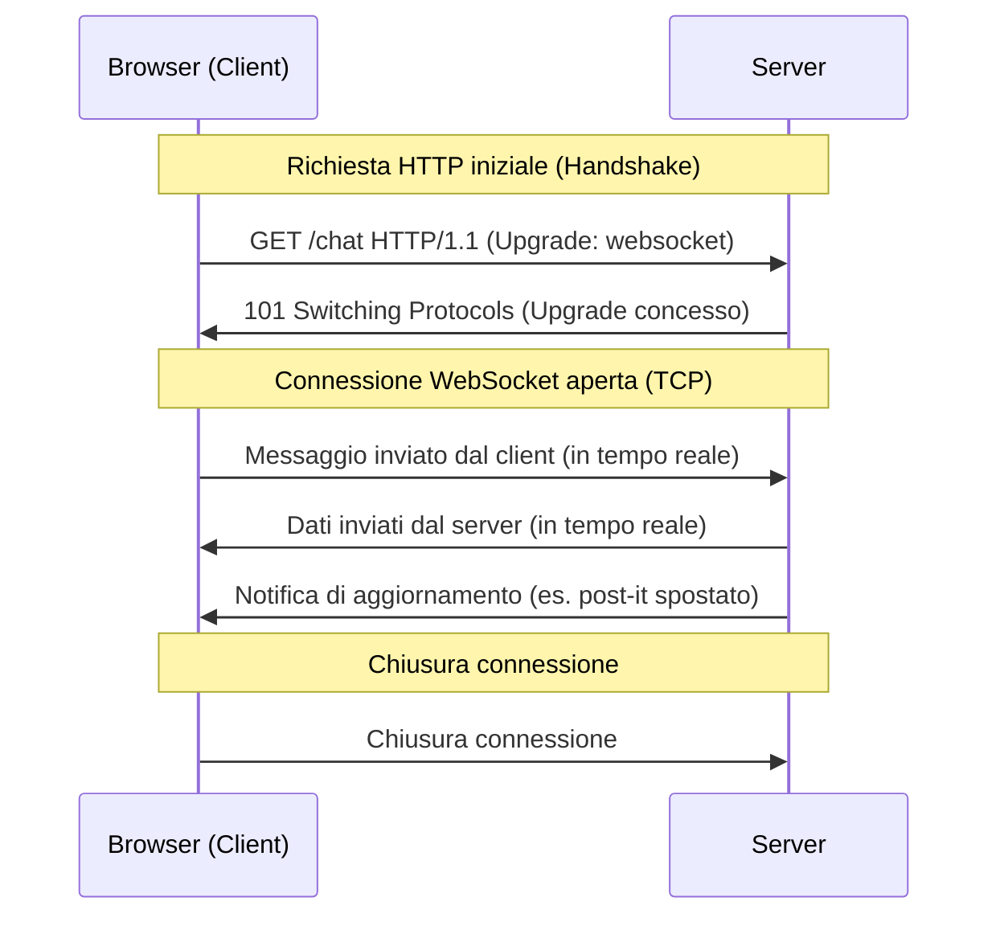

# Parte 1: Le Basi del Web (Teoria & Ispezione)

---

## | [« Indice Giorno 3](README.md) | **Parte 1: Le Basi del Web (Teoria & Ispezione)** | [Parte 2: Frontend Rapido con Tailwind CSS (Sviluppo UI)](02-frontend-rapido-tailwind.md) » |

Prima di costruire applicazioni complesse in cloud, dobbiamo capire come funziona la spina dorsale del Web: l'architettura client-server e il protocollo di comunicazione HTTP/HTTPS. In questa lezione impareremo anche ad ispezionare il funzionamento della rete direttamente dal browser.

---

## 🌐 1. L'Architettura Client-Server

Il World Wide Web si fonda su un modello strutturato in due ruoli principali:


- **Il Client**: È il dispositivo o l'applicazione che effettua una richiesta (es. il browser Chrome sul tuo laptop, o un'applicazione mobile). Riceve i dati (HTML, CSS, JS, JSON) e li traduce in un'interfaccia grafica per l'utente.
- **Il Server**: È un computer remoto (spesso situato in un data center in cloud) configurato per essere costantemente in ascolto di richieste. Quando ne riceve una, elabora la logica di business, legge o scrive su un database e invia indietro una risposta.

---

## 🔌 2. Il Protocollo HTTP/HTTPS

**HTTP** (HyperText Transfer Protocol) è l'insieme di regole standard che client e server utilizzano per capirsi. **HTTPS** è la versione sicura (criptata) del protocollo, che protegge la riservatezza dei dati in transito tramite certificati SSL/TLS.

La comunicazione avviene esclusivamente tramite il ciclo **Richiesta (Request) ➔ Risposta (Response)**. Il server non può inviare dati al client spontaneamente (a meno che non si utilizzino tecnologie speciali come le WebSocket o Firebase, che vedremo più avanti); deve sempre attendere una richiesta esplicita del client.

---

## 📝 3. Anatomia di una Richiesta HTTP

Quando inserisci un URL nella barra del browser o fai clic su un pulsante, il client formula un messaggio strutturato composto da quattro parti fondamentali:

### A. Il Metodo (o Verbo) HTTP

Definisce l'azione che il client desidera compiere sulla risorsa del server. I 4 metodi fondamentali (spesso mappati sulle operazioni CRUD dei database) sono:

- **`GET`**: Richiede la lettura di una risorsa (es. caricare una pagina web, scaricare un'immagine). Non deve modificare lo stato del server.
- **`POST`**: Invia dati al server per creare una nuova risorsa (es. salvare un nuovo post-it, effettuare il login). I dati sono inseriti nel _Body_ della richiesta.
- **`PUT`**: Aggiorna interamente una risorsa esistente sul server (es. aggiornare il testo e le coordinate di un post-it).
- **`DELETE`**: Rimuove una risorsa dal server.

### B. L'Indirizzo (URI / URL) e Query Parameters

L'identificatore della risorsa a cui inviare la richiesta. Può contenere parametri aggiuntivi:

- `https://api.esempio.it/utenti` (Accede alla collezione utenti)
- `https://api.esempio.it/cerca?q=postit&categoria=lavoro` (I parametri dopo il punto di domanda `?` sono chiamati **Query Parameters** e servono per filtrare o passare dati leggeri in GET).

### C. Gli Headers (Intestazioni)

Metadati sulla richiesta. Contengono informazioni utili come:

- `Content-Type: application/json` (Avvisa il server che il corpo della richiesta contiene un file JSON).
- `User-Agent` (Il tipo di browser e sistema operativo del client).
- `Authorization: Bearer <token>` (Credenziali per verificare l'identità dell'utente).

### D. Il Body (Corpo)

Il carico utile (payload) inviato al server, utilizzato soprattutto nei metodi `POST` e `PUT`. Solitamente formattato in **JSON (JavaScript Object Notation)**:

```json
{
  "testo": "Comprare il pane",
  "x": 120,
  "y": 350,
  "colore": "giallo"
}
```

---

## 📦 4. Anatomia di una Risposta HTTP

Una volta elaborata la richiesta, il server restituisce una risposta strutturata in:

### A. Gli Status Code (Codici di Stato)

Numeri a tre cifre che indicano l'esito della richiesta. Sono divisi in famiglie:

- **`2xx` (Successo)**: La richiesta è stata completata positivamente.
  - `200 OK` (Operazione riuscita).
  - `201 Created` (Risorsa creata con successo).
- **`3xx` (Reindirizzamento)**: Il client deve compiere un'ulteriore azione per completare la richiesta.
  - `301 Moved Permanently` (La pagina si è trasferita).
- **`4xx` (Errore del Client)**: La richiesta contiene un errore o non è valida.
  - `400 Bad Request` (Dati inviati errati o incompleti).
  - `401 Unauthorized` (Utente non autenticato).
  - `404 Not Found` (La risorsa richiesta non esiste sul server).
- **`5xx` (Errore del Server)**: Il server ha riscontrato un problema interno nell'elaborazione.
  - `500 Internal Server Error` (Bug nel codice del server).

### B. Headers della Risposta

Metadati del server (es. tipo di server, data, e formato dei dati restituiti come `Content-Type: application/json`).

### C. Il Body della Risposta

I dati effettivi restituiti. Può contenere il file HTML della pagina, un foglio di stile CSS, file JS o dati puri in formato JSON inviati da un'API.

---

## 🔬 5. Laboratorio Pratico: Ispezionare la Rete (Chrome DevTools)

Per vedere concretamente come client e server comunicano, faremo un'esercitazione pratica utilizzando la console di Chrome:

### Esercizio Passo-Passo

1. Apri il browser Chrome e naviga su un sito di notizie o un'applicazione web (es. [Wikipedia.org](https://wikipedia.org) o un sito a tua scelta).
2. Apri gli strumenti di sviluppo (Chrome DevTools):
   - Fai clic destro in un punto qualsiasi della pagina e seleziona **Ispeziona** (oppure premi il tasto scorciatoia `F12` o `Cmd+Option+I` su Mac).
3. Seleziona la scheda **Network (Rete)** in alto.
4. Ricarica la pagina (`F5` o `Cmd+R`). Vedrai apparire una lista in tempo reale di tutte le richieste effettuate dal browser al server per caricare la pagina.
5. **Esplora i Filtri**:
   - Seleziona **Doc** per vedere solo la richiesta iniziale del file HTML.
   - Seleziona **Fetch/XHR** per vedere solo le richieste asincrone di dati (solitamente API JSON).
6. **Analizza una Richiesta**:
   - Fai clic su una delle chiamate nella lista.
   - Esplora la sezione **Headers** per verificare il metodo HTTP (GET/POST), lo Status Code (es. `200 OK`) e gli indirizzi remoti.
   - Esplora la sezione **Payload** per vedere i dati inviati al server.
   - Esplora la sezione **Response** (o **Preview**) per vedere l'output esatto che il server ha restituito al browser.

---

## ⚡ 6. Oltre HTTP: Le WebSocket e la Comunicazione Real-Time

Fino ad ora abbiamo visto il protocollo **HTTP**, che si basa esclusivamente sul ciclo **Richiesta ➔ Risposta** ed è guidato dal client. Questo modello ha un limite strutturale per le applicazioni moderne: se i dati sul server cambiano (ad esempio, un compagno sposta un post-it sulla lavagna), il tuo browser non può saperlo finché non effettua una nuova richiesta.

Per superare questo limite e consentire una comunicazione istantanea e persistente, è stato creato il protocollo **WebSocket**.

### Cos'è una WebSocket?

Una WebSocket è un protocollo di rete che fornisce un canale di comunicazione **bidirezionale** (full-duplex) e **persistente** (sempre aperto) attraverso una singola connessione TCP tra il browser (client) e il server.

- **HTTP (Richiesta/Risposta)**: È come spedire una lettera. Fai una domanda (richiesta), ricevi una lettera di risposta, e il contatto si chiude lì. Se vuoi un altro aggiornamento, devi rispedire una lettera.
- **WebSocket (Canale aperto)**: È come una telefonata. Una volta stabilito il contatto, la linea rimane aperta ed entrambi i partecipanti possono parlare (inviare dati) in qualsiasi momento, senza bisogno di richiamare.



### Come funziona il Ciclo di Vita di una WebSocket?

1. **L'Handshake (La stretta di mano)**: La connessione inizia sempre con una normale richiesta HTTP del client, che inserisce un'intestazione speciale (`Upgrade: websocket`) per comunicare al server l'intenzione di cambiare protocollo. Se il server supporta le WebSocket, risponde con lo Status Code `101 Switching Protocols`.
2. **Connessione Persistente**: Il canale HTTP viene "promosso" ad una connessione WebSocket. Da questo momento, il protocollo HTTP viene spento e la connessione TCP sottostante rimane attiva a tempo indeterminato.
3. **Scambio dati bidirezionale**: Sia il client che il server possono inviare piccoli pacchetti di dati (chiamati _frames_) in tempo reale e in modo asincrono.
4. **Chiusura della connessione**: La connessione può essere chiusa in qualsiasi momento da una delle due parti (es. se l'utente chiude la scheda del browser o se il server va offline).

---

### Come si implementa: Esempio pratico in JavaScript

I browser moderni integrano nativamente l'API WebSocket. Non è necessario installare alcuna libreria esterna.

Ecco come aprire un canale di comunicazione e gestire i messaggi in JavaScript:

```javascript
// 1. Creazione della connessione a un server WebSocket
// Nota: si usa il protocollo "ws://" (non criptato) o "wss://" (criptato, raccomandato)
const socket = new WebSocket('wss://echo.websocket.org');

// 2. Ascolto dell'evento di connessione aperta
socket.addEventListener('open', (event) => {
  console.log('Connesso al server WebSocket con successo!');

  // Inviamo un messaggio di prova al server
  socket.send('Ciao Server! Sto testando la connessione.');
});

// 3. Ascolto dei messaggi inviati dal server
socket.addEventListener('message', (event) => {
  // event.data contiene il corpo del messaggio inviato dal server
  console.log('Nuovo messaggio ricevuto dal server:', event.data);
});

// 4. Gestione degli errori di rete
socket.addEventListener('error', (error) => {
  console.error('Errore nella connessione WebSocket:', error);
});

// 5. Gestione della chiusura del canale
socket.addEventListener('close', (event) => {
  console.log('La connessione WebSocket è stata chiusa.');
});
```

### Perché è importante per il nostro progetto?

La magia del database in tempo reale che useremo più tardi (Firebase Firestore) si basa proprio su tecnologie di connessione persistente simili alle WebSocket. Quando richiamiamo la funzione `onSnapshot()`, il client non interroga continuamente il database (polling), ma rimane in ascolto passivo su un canale aperto. Non appena un utente modifica un post-it, il server di Firebase spinge immediatamente l'aggiornamento a tutti gli altri browser connessi in pochissimi millisecondi.

---

[« Indice Giorno 3](README.md) | **Parte 1: Le Basi del Web (Teoria & Ispezione)** | [Parte 2: Frontend Rapido con Tailwind CSS (Sviluppo UI)](02-frontend-rapido-tailwind.md) » |
